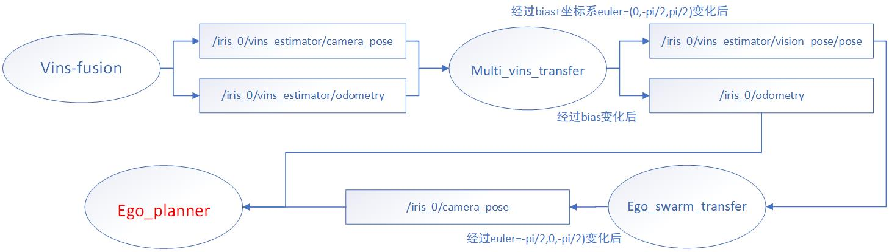
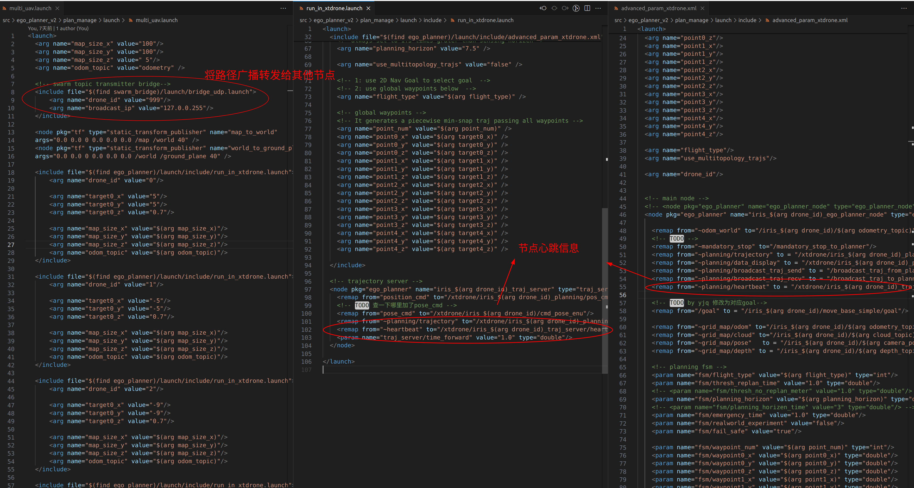
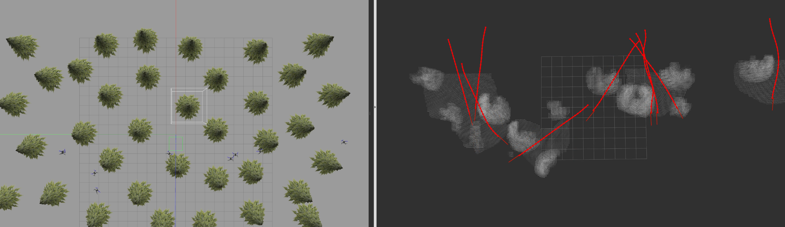
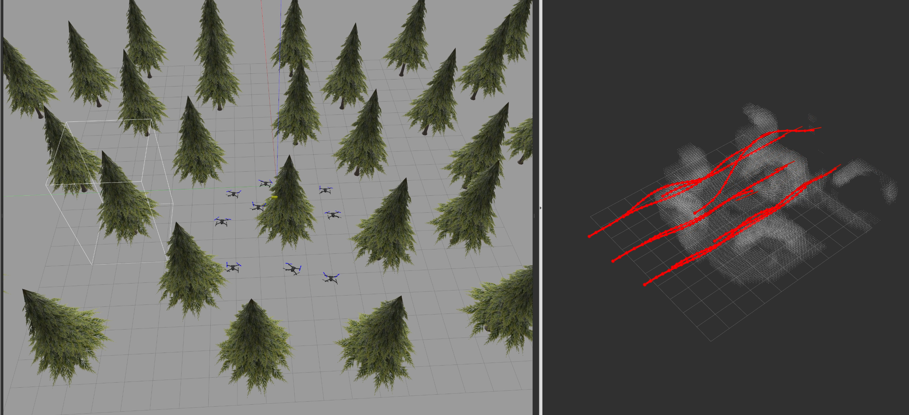

## EGO-SWARM2移植到XTdrone平台

#### 一、EGO-SWARM1

​	首先，XTDrone平台自带ego-swarm1版本的代码，参照其[参考文档](https://www.yuque.com/xtdrone/manual_cn/swarm_motion_planning)，采用EGO-Planner-Swarm+VINS-Fusion将其跑通。EGO-Planner-Swarm与外部其他功能算法之间的接口仅有里程计信息odom和目标点信息goal。下图为采用EGO-Planner-Swarm+VINS-Fusion的主要接口图，/iris_0/vins_estimator/camera_pose与/iris_0/camera_pose消息，尽管经过两步欧拉角坐标变换，但是效果抵消，仅仅相差一个偏置量bias。**由于XTDrone使用的仿真世界为室内世界，加上VINS-Fusion本身定位精度不高，无人机及其容易撞到障碍物，造成VINS-Fusion定位失效。**根据接口图，可以将对于定位信息和里程计信息直接更换成gazebo仿真世界中的真实信息，从而解决VINS-Fusion定位信息飘飞的问题。另外，可以将XTDrone使用的仿真世界改为室外丛林环境，室内环境存在封闭密室，存在EGO-Planner-Swarm中A*搜索不到部分路径的情况。

#### 二、EGO-SWARM2

​	完成上述demo之后，相信你对XTdrone和ego-swarm1有了更深的理解，下面介绍如何移植ego-swarm2到XTdrone平台。ego-swarm2存在4个版本，这里尝试移植了编队版本和普通集群版本。ego-swarm2相较与ego-swarm1最主要变化是使用MINCO曲线替代了B样条曲线，另外增加了广播功能以实现分布式效果。参照swarm.launch -> run_in_sim.xml -> advanced_param.xml文件，仿照XTdrone中ego-swarm1配置文件，修改完善即可使用。特别需要注意的是广播节点和心跳话题需要对应上，否则其他ego-planner节点无法接受到信息而被阻塞。

​	集群版本对应效果，==具体视频见assets文件夹中==：

​	编队版本对应效果，视频效果与上述类似，==具体视频同样见assets文件夹中==：

